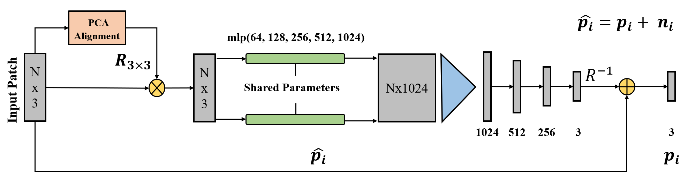

# Pointfilter: Point Cloud Filtering via Encoder-Decoder Modeling
This is our implementation of Pointfilter, a network that automatically and robustly filters point clouds by removing noise and preserving their sharp features.

<p align="center">  </p>

The pipeline is built based on [PointNet](http://stanford.edu/~rqi/pointnet/) (a patch-based version of [PointNet](http://stanford.edu/~rqi/pointnet/)). Instead of using STN for alignment, we align the input patches by aligning their principal axes of the PCA with the Cartesian space.

## Environment
* Python 3.6
* PyTorch 1.0.0
* CUDA and CuDNN (CUDA 9.0 & CuDNN 7.0)
* TensorboardX (1.6) if logging training info. 


## Datasets
You can download the training datasets used in this work from the following [link](https://entuedu-my.sharepoint.com/:f:/g/personal/n1805982j_e_ntu_edu_sg/Er5PVpfMIBZDiucsZSUX-AsB8QXXHIfzVfENWSj1u9TNng?e=wEFDZY), or prepare yourself datasets and change corresponding codes in `Pointfilter_DataLoader.py`. Create a folder named Dataset and unzip the files on it. In the datasets the input and ground truth point clouds are stored in different files with '.npy' extension. For each clean point cloud `name.npy` with normals `name_normal.npy`, there are 5 correponsing noisy models named as `name_0.0025.npy`, `name_0.005.npy`, `name_0.01.npy`, `name_0.015.npy`, and `name_0.025.npy`.  


## Setup
Install required python packages:
``` bash
pip install numpy
pip install scipy
pip install scikit-learn
pip install tensorboardX (only for training stage)
```

Clone this repository:
``` bash
git clone https://github.com/dongbo-BUAA-VR/Pointfilter.git
cd Pointfilter
```

## Train
Use the script `train.py` to train a model in the our dataset:
``` bash
cd Pointtilter
python train.py
```

## Test with Pre-trained Model
``` bash
cd Pointtilter
python eval.py
```

## Errors of point clouds in Fig. 6 (4 models with 0.5% Gaussian noise)
|Models | Chamfer Distance (10^-5) | Mean Square Error (10^-3)| 
| - | - | - | 
|Boxunion    | 0.899 | 4.235|
|Cube        | 1.236 | 5.314|
|Fandisk     | 0.699 | 3.952|
|Tetrahedron | 0.745 | 4.098|

<p align="center"> 
  
## Visual Results

<p align="center"> 


## Acknowledgements
This code largely benefits from following repositories:
* [PointNet](http://stanford.edu/~rqi/pointnet/)
* [PCPNet](https://github.com/paulguerrero/pcpnet)
